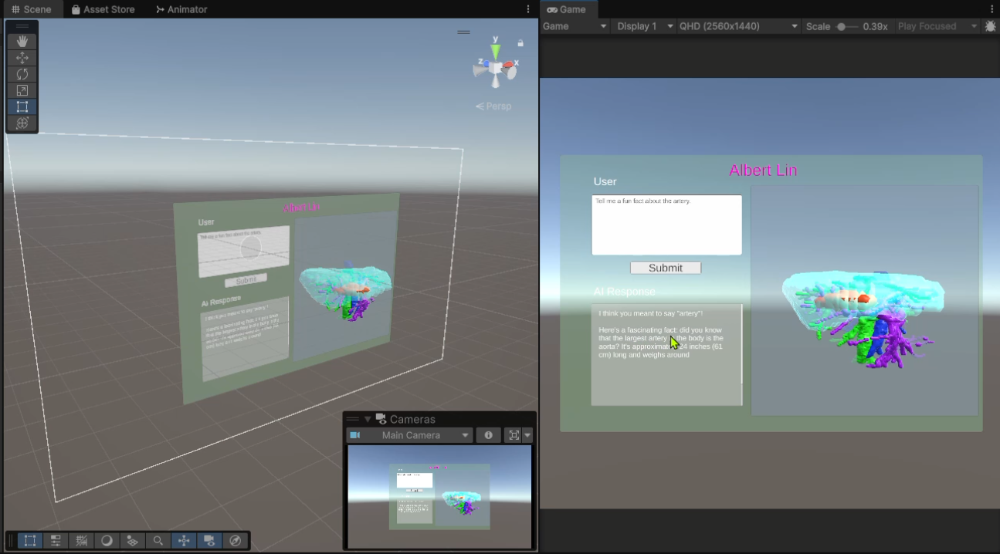

# Clinical 3D Medical Assistant

LLM-guided patient interaction and 3D model creation in Unity for medical visualization. This project combines a conversational assistant with procedural model tooling and curated materials to support clinical education, planning, and patient-facing explanations.

## Overview
This project integrates an LLM-backed assistant with a Unity-based workflow for building and presenting medical 3D models. The assistant facilitates patient-friendly dialogue while the modeling window streamlines generating and organizing anatomical structures. Curated materials for liver, arteries, veins, and tumors provide clear differentiation and visual clarity. A modular UI ties the interaction and visualization together for a cohesive experience.

## Features
- Conversational assistant: guided interactions via `LLMController.cs` to help explain findings.
- Patient interaction flow: structured prompts and responses in `PatientInteraction.cs`.
- 3D model builder: create and manage anatomical models with `Create3DModelWindow.cs`.
- Curated materials: liver, portal vein, arteries, and tumor variants for quick visualization.
- Modular UI prefab: reusable interface in `Prefab/UI.prefab` for fast scene setup.

## Project Structure
- Assistant & Interaction
  - [Scripts/LLMController.cs](Scripts/LLMController.cs)
  - [Scripts/PatientInteraction.cs](Scripts/PatientInteraction.cs)
- Modeling Tools
  - [Scripts/Create3DModelWindow.cs](Scripts/Create3DModelWindow.cs)
- UI
  - [Prefab/UI.prefab](Prefab/UI.prefab)
- Materials
  - [Materials/Liver.mat](Materials/Liver.mat)
  - [Materials/PortalVein.mat](Materials/PortalVein.mat)
  - [Materials/Artery.mat](Materials/Artery.mat)
  - [Materials/Veinoussystem.mat](Materials/Veinoussystem.mat)
  - [Materials/LiverTumor01.mat](Materials/LiverTumor01.mat), [Materials/LiverTumor02.mat](Materials/LiverTumor02.mat)

## Getting Started
- Prerequisites: Unity (LTS version recommended). Ensure a recent editor version that supports your pipeline and materials.
- Open the project folder in Unity and create or load a scene.
- Drag `Prefab/UI.prefab` into the scene to initialize the interface.
- Place anatomical meshes or use the modeling window to create and arrange structures.

## Configuration
- LLM integration: configure your LLM provider inside `LLMController.cs` (e.g., API keys or local model settings).
- Materials: assign the provided `.mat` assets to renderers to visually distinguish structures.

## Usage
- Launch the scene and use the UI to:
  - Start guided conversations with the assistant for patient-facing explanations.
  - Open the 3D Model Window to create, label, and organize anatomical components.
  - Apply materials to highlight organs, vessels, and lesions.

